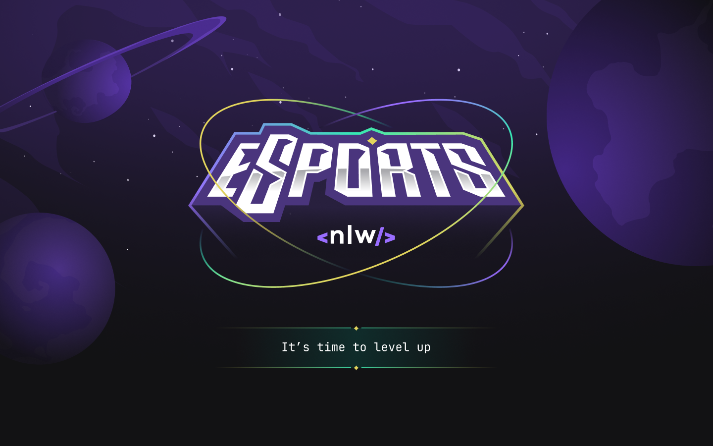

# eSports - NLW Rocketseat 🚀

  

## Description

This project was created during the Next Level Week - NLW eSports, an event developed by Rocketseat.

The eSports application is the final project of the Ignite Mission.

## Tools and language used:
* [React](https://reactjs.org/)
* [React Native](https://reactnative.dev/)
* [React Navigation](https://reactnavigation.org/)
* [Expo](https://expo.dev/)
* [Vite](https://vitejs.dev/)
* [RadixUI](https://www.radix-ui.com/)
* [Tailwind](https://tailwindcss.com/)
* [Phosphor](https://phosphoricons.com/)
* [Figma](https://www.figma.com/)
* [Node.js](https://nodejs.org/en/)
* [Prisma](https://www.prisma.io/)
* [Express](https://expressjs.com/pt-br/)
* [Cors](https://www.npmjs.com/package/cors)
